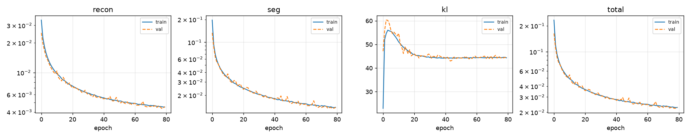
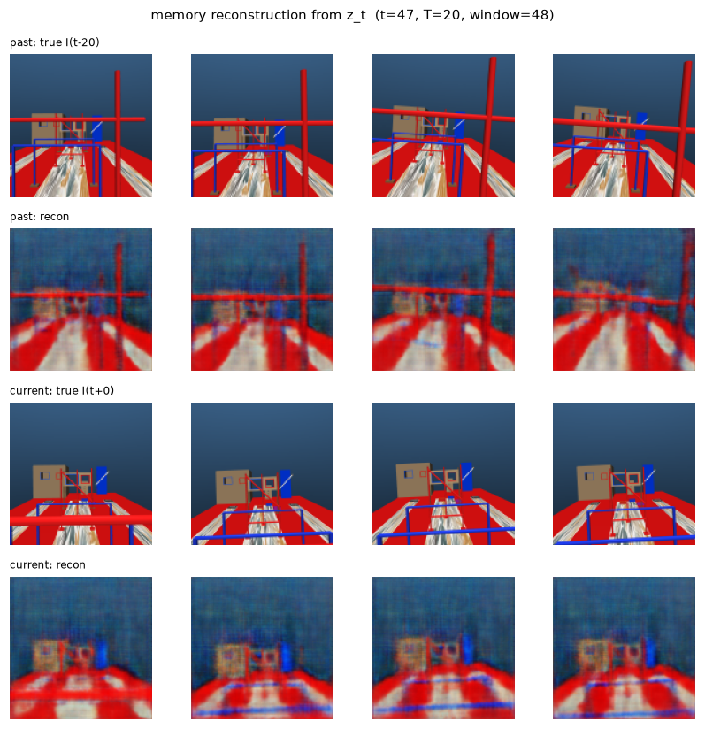

# Vision-only flight through the IMAV obstacle course

A memory-augmented RL pipeline that flies a Crazyflie-class quadrotor through a
multi-station obstacle course from onboard RGB-D alone. No gate poses, no
waypoints, no privileged state in the observation. The drone has to read the
course off the camera and remember what it saw, because by the time it reaches a
bar the bar is no longer in frame.

The approach follows MAVRL (Yu et al., RA-L 2025), which trains a latent space
that explicitly retains memory of past depth observations and lets the policy
vary its speed with the difficulty of what is ahead. This repo is not a
reimplementation. The task is different (a structured course with a colour rule
rather than random clutter), the encoder is different, and the goal is a working
policy rather than a comparison against the paper's numbers.

## The task

The arena is the IMAV competition course, scaled 2.2x, loaded from the
competition SDF. All distances below are in those scaled units; divide by 2.2
for competition metres.

The drone spawns behind an entry wall and flies down-course through:

1. **Entry window.** Two openings, one red and one blue. Red is the target, blue
   is a decoy. Same size, same height, so the only cue is colour.
2. **Zero to three bar stations**, 2.20 apart. Each has a horizontal bar between
   two posts, and the bar's colour is the rule: **red means pass above it, blue
   means pass below it.**
3. **Exit window**, same red/blue arrangement as the entry.

Bar heights are drawn per episode. Red bars sit at 2.640, 3.520 or 4.356; blue
at 0.880, 1.760 or 2.640. Two heights (red 3.520, blue 1.760) are held out of
training entirely so there is an honest test of whether the policy learned the
colour rule or memorised the heights it saw.

There are also fixed obstacles from the competition course that are not gates
and carry no reward: tubes, boxes, and a turbine. They are simply things to
avoid.

The reason this needs memory rather than reaction: the onboard camera is fixed
and forward-facing. After descending under a blue bar at 0.880, the next red bar
at 4.356 is 2.20 ahead and roughly 3.9 above, well outside the vertical field of
view. The drone flies the whole final approach to that bar blind, on what it saw
several seconds earlier.

## Pipeline

Four stages, each with its own script and checkpoint.

| Stage | Script | Produces |
|---|---|---|
| Data collection | `mavrl/collect.py` | RGB-D, clean RGB-D, segmentation, metric depth, proprioception, actions, per-episode success |
| Semantic VAE | `mavrl/train_sevae.py` | `ckpt/sevae.pt` |
| Memory model | `mavrl/train_memory.py` | `ckpt/memory_*.pt` |
| Behaviour cloning | `mavrl/bc.py` | `ckpt/bc_init.pt` |
| PPO | `mavrl/train_course.py` | `runs/final.pt` |

**Observation.** MuJoCo renders at 512x512 and the observation is downsampled to
128x128x4 (RGB plus depth). The gap is not decoration: an 0.08 m bar subtends
about 9.8/d pixels at 128, so rendering natively at 128 aliases thin bars away
entirely. Rendering at 512 and min-pooling the depth channel keeps them. Depth
is clipped at 16 units, which holds the next two stations inside the sensor
while cutting off the far room.

Alongside the image is a 16-d proprioceptive vector: gravity direction in the
body frame, gyro, body velocity, the velocity-command integrator state, and the
previous action. Everything in it is measurable onboard. Notably absolute
heading is not, since gravity in the body frame is invariant to rotation about
z.

**Action space.** Body-frame acceleration (3) plus a yaw rate (1), integrated
into a velocity setpoint and tracked by a cascaded PID. The policy runs at 10 Hz
over a 60 Hz PID over 240 Hz physics, so one command is held across six control
ticks and the frame is rendered once per policy step. That is what makes the 512
raster affordable.

**Semantic VAE.** A six-conv encoder to a 64-d latent with three decoder heads:
RGB, depth, and a segmentation map. The reconstruction loss is
proximity-weighted, `w = 0.05 + 0.95(1-t)^2` with `t` the normalised distance, so
the encoder spends its capacity on what is close enough to hit. The segmentation
head is what keeps red and blue bars separable in the latent, which matters
because the colour rule is the whole task and an unsupervised reconstruction
loss has no particular reason to preserve hue.

**Memory.** Either an LSTM or temporal attention with recurrent memory tokens,
behind one flag. Both are trained with an auxiliary reconstruction objective:
from the current latent, rebuild the image from 20 steps ago as well as the
current one. The offset is deliberately longer than the attention window, so the
task cannot be satisfied by attending to a frame still in the buffer. It has to
be retained.

## Results so far

### Semantic VAE

80 epochs on the scripted-pilot dataset. Validation is a held-out split of whole
episodes, not of windows, since windows overlap and a window-level split would
leak nearly the entire training set.

| | epoch 0 | epoch 40 | epoch 79 |
|---|---|---|---|
| recon (val) | 0.0251 | 0.0054 | **0.0045** |
| segmentation CE (val) | 0.1330 | 0.0176 | **0.0138** |
| KL (val) | 47.14 | 44.09 | 44.84 |
| total (val) | 0.1628 | 0.0275 | **0.0228** |

Training and validation losses stay within about a percent of each other at
convergence (train total 0.0227 against val 0.0228), so there is no meaningful
overfitting to report.


Rows, top to bottom: the noisy RGB the encoder actually receives, the clean RGB
it is scored against, its reconstruction, then target and reconstructed depth,
then true and predicted segmentation. Six validation samples.

Three things worth pointing out. The first two rows differ and the third matches
the second, so the encoder is denoising rather than modelling its own sensor
noise, which is the point of scoring against the clean render. The RGB
reconstruction is visibly blurry, and that is fine and expected from a 64-d
latent under a proximity weight; what matters is that the red and blue survive
intact and in the right places. And the depth head keeps thin structure that the
RGB head smears, including the diagonal brace in columns two and three, which is
the geometry the drone has to not hit.

The segmentation is the part that matters most for this task. At 0.0138 CE the
predicted maps track the true ones closely, with the errors confined to speckle
on thin members and a little bleed at edges. Bar-red and bar-blue never get
confused with each other, which is the precondition for the policy being able to
apply the colour rule at all.



### Memory model

Temporal attention, 4 recurrent memory tokens, 20 epochs.

| | epoch 0 | epoch 10 | epoch 19 |
|---|---|---|---|
| past reconstruction (val) | 0.0262 | 0.0142 | **0.0132** |
| current reconstruction (val) | 0.0112 | 0.0095 | **0.0096** |

Past reconstruction is consistently worse than current, which is what should
happen: rebuilding the frame from 20 policy steps ago is a genuine memory task,
rebuilding the current one is not. The gap closing from 2.3x to 1.4x over
training is the memory actually being used.



Both reconstructions come from the same latent `z_t`. The top pair is the frame
from 20 policy steps ago, two seconds of flight earlier; the bottom pair is the
current one.

This is the figure the whole design rests on. In the current frames the red
overhead bar has already left the field of view, and the drone is looking at
blue structure and floor. The past reconstruction still puts the red bar back
where it was. That information exists nowhere in the current image, so it is
being carried in the recurrent state rather than read off the input, which is
exactly what the policy needs when it commits to a bar it can no longer see.
The reconstructions are coarse, as a 64-d latent forces them to be: gross layout
and colour survive, fine detail does not.

### Policy

The policy itself is still being trained. That work is ongoing and the
results are not settled, so nothing is reported here yet.

## Layout

```
mavrl/
  course_world.py    arena geometry, curriculum sampling, held-out heights
  course_gates.py    gate crossing logic, pass/fail outcomes
  course_aviary.py   the environment: observation, action, reward, termination
  sensor_noise.py    depth noise, edge dropout, dead pixels
  imageproc.py       512 to 128 downsampling, segmentation class mapping
  sevae.py           encoder, decoder heads, proximity-weighted loss
  memory.py          LSTM and attention backbones, auxiliary reconstruction
  policy.py          actor-critic over the encoder and memory
  ppo.py             recurrent PPO
  collect.py         scripted pilot, parallel headless data collection
  teleop.py          fly it yourself and record the result
  bc.py              behaviour cloning
  train_sevae.py     stage 2
  train_memory.py    stage 3
  train_course.py    PPO
  evaluate.py        headless evaluation, including held-out heights
  fly.py             watch a checkpoint fly, with live RGB/depth/segmentation
  preview.py         render an episode to mp4
  visualize.py       training curves
```

`rl/` is an earlier single-window task kept as a baseline and deliberately left
alone. `multi_drone_mujoco/` is the underlying simulator package.

## Running it

Collection is parallel and headless. Each worker gets its own GL context and
writes its own shards, so it scales until the GPU saturates.

```bash
python -m mavrl.collect --episodes 2000 --workers 6 --out data
python -m mavrl.train_sevae --data data --out ckpt/sevae.pt
python -m mavrl.train_memory --data data --memory-type attention --mem-tokens 4
python -m mavrl.bc --data data --memory-type attention --mem-tokens 4 \
    --eval-episodes 20
python -m mavrl.train_course --init ckpt/bc_init.pt \
    --memory-type attention --mem-tokens 4 --stage 3 --curriculum --out runs
```

Watch a checkpoint fly, third-person plus the live camera feeds:

```bash
python -m mavrl.fly --model runs/final.pt
```

Training writes `log.jsonl` and redraws `curves.png` every few rollouts, so a
run on a remote box can be watched by pulling a single file. Worth watching in
particular: gate fraction, the terminal-reason mix, and mean absolute heading
error.

Rendering needs EGL on a headless box (`MUJOCO_GL=egl`, set by default in the
training scripts) or GLFW with a display.

## Base simulator

The physics, PID controllers and Gymnasium plumbing come from MJ-drones-gym, a
MuJoCo multi-drone environment package:

```bibtex
@misc{tayal2026mujocodronesgym,
  title={MuJoCo-Drones-Gym: A GPU-Accelerated Multi-Drone Simulator for Control
         and Reinforcement Learning},
  author={Manan Tayal},
  year={2026},
  eprint={2606.08039},
  archivePrefix={arXiv},
  primaryClass={cs.RO},
  url={https://arxiv.org/abs/2606.08039},
}
```

Its own documentation, task environments and examples are unchanged and still
usable; see `multi_drone_mujoco/`.

## References

- Yu, Ferranti et al. *MAVRL: Learn to Fly in Cluttered Environments with
  Varying Speed.* RA-L 2025. https://github.com/tudelft/mavrl
- MuJoCo Menagerie, for the Bitcraze Crazyflie 2.x MJCF model.

## Status

Active work in progress. The environment, the encoder and the memory model are
in place, and the policy is still being experimented with and trained. Nothing
here should be treated as finished or used as-is yet.

## License

MIT
